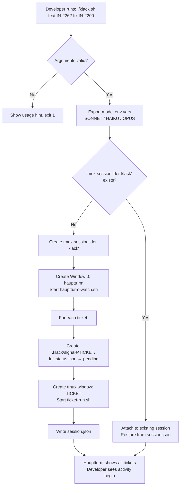
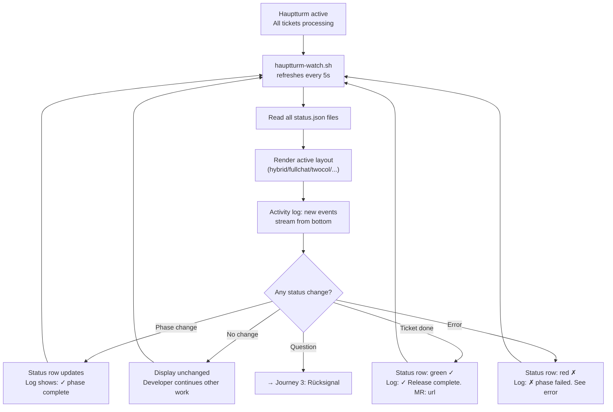
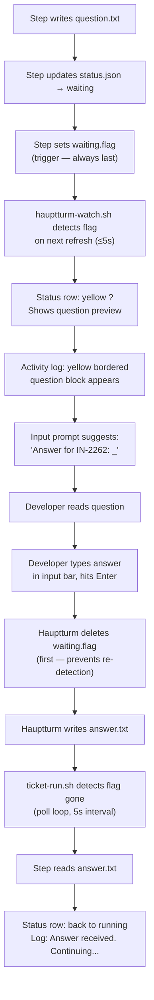
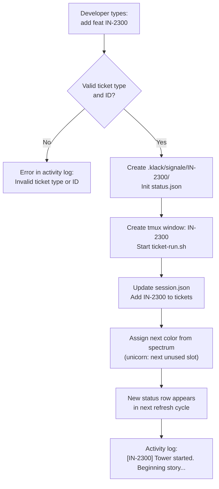
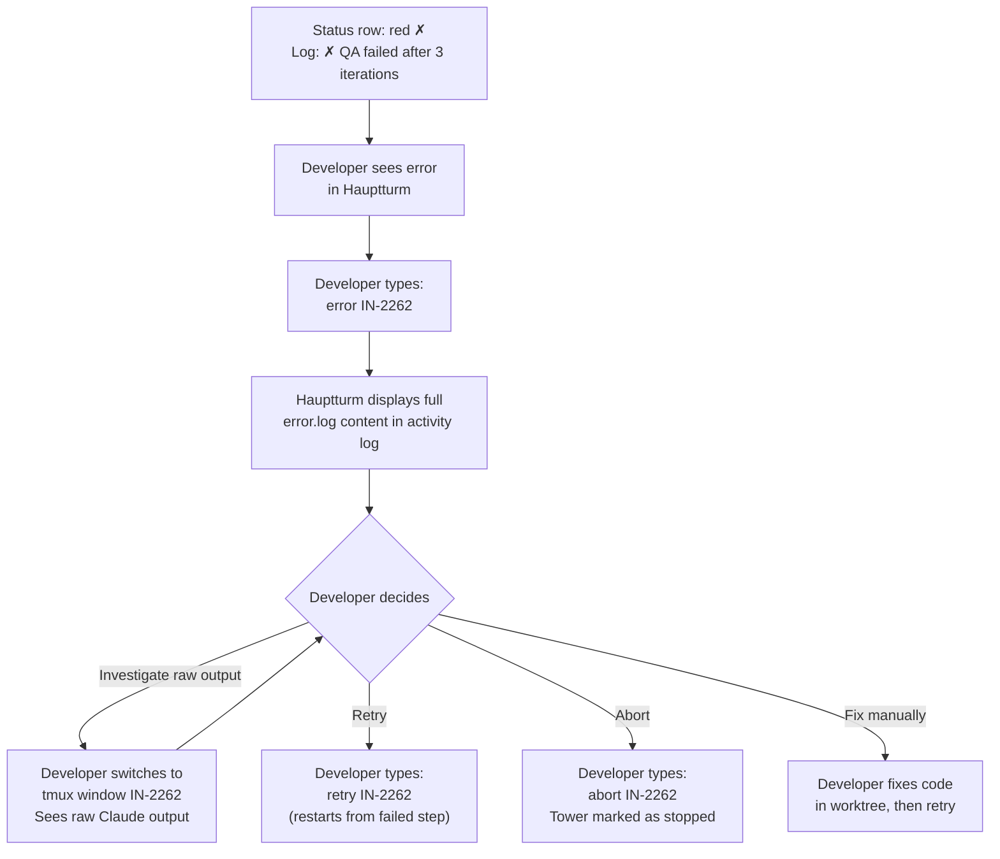
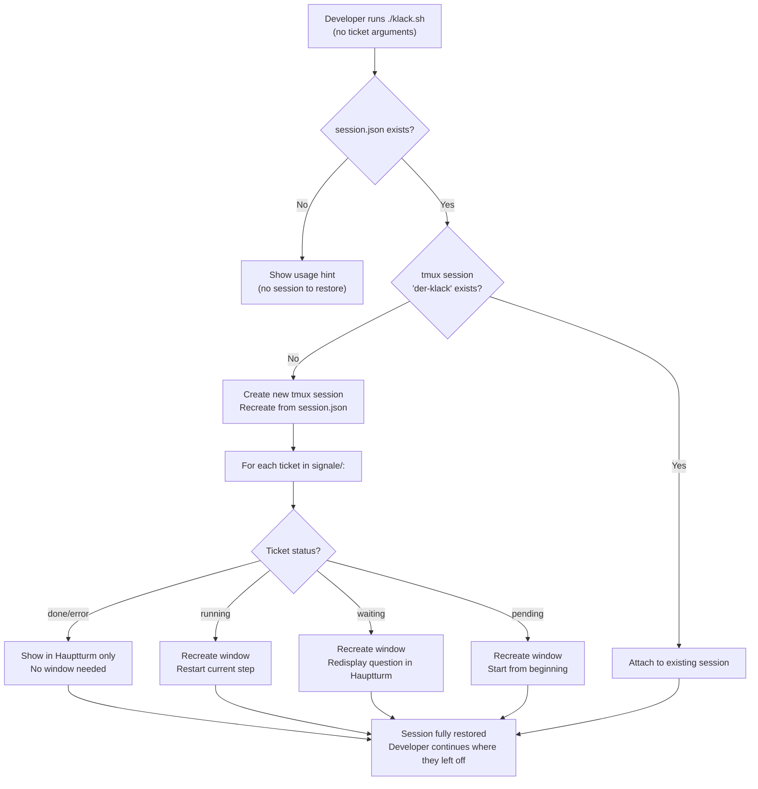

# UX Design Specification cc-crew (Der Klack)

**Author:** Postmeister
**Date:** 2026-03-20

---

<!-- UX design content will be appended sequentially through collaborative workflow steps -->

## Executive Summary

### Project Vision

Der Klack is a terminal-native autonomous development pipeline. The developer's primary interaction surface is a tmux-based TUI (Terminal User Interface) — no web UI, no Electron wrapper, no GUI. The UX must be optimized for a single, highly technical user who wants maximum observability with minimum interruption.

The core promise: start it, trust it, intervene only when it matters.

### Target Users

**Primary User: The Postmeister (solo developer)**
- Expert-level terminal user, tmux-native
- Runs multiple tickets in parallel across projects
- Wants ambient awareness without context-switching
- Tolerates (and prefers) information-dense displays over simplified UIs
- Interrupted only for decisions they genuinely need to make

### Key Design Challenges

1. **Information density vs. readability**: Multiple tickets running in parallel. Each has 5 phases and can be in waiting/running/error state. All visible at once without overwhelming.

2. **Prominent question display**: When a ticket blocks for developer input, this must break through the ambient noise immediately. No missed questions.

3. **The large "chat" vs. compact status split**: The developer wants a large main view (chat/log flow) AND per-ticket compact status tiles. These are two competing information needs in a finite terminal space.

4. **Dynamic layout**: Tickets get added during runtime. The layout must reflow gracefully without disrupting the developer's ongoing interaction.

### Design Opportunities

1. **Phase-as-progress-bar**: The 5 phases (story → dev → qa → review → release) map perfectly to a compact visual progress indicator per ticket. Each phase lights up as it completes.

2. **Noise-free ambient mode**: When everything is running normally, the display should be calm. Only when action is needed does it escalate visually.

3. **Chat-pane as universal log**: The large center pane shows a unified, auto-scrolling stream of what's happening — across all tickets. Think `tail -f` but curated and formatted.

## Core User Experience

### Defining Experience

The core loop is radically simple: the developer types one command and waits.
The system does the work. The developer's role is observer and decision-maker,
not driver.

Primary interaction: `./klack.sh feat IN-2262 fix IN-2200`
After that: watch, trust, answer when called.

The experience succeeds when the developer forgets the system is running —
until it needs them.

### Platform Strategy

**Platform:** Terminal-native TUI via tmux. No web, no GUI, no Electron.
**Input:** Keyboard-only. Mouse support is irrelevant.
**Environment:** Developer's existing terminal, tmux session manager.
**Constraint:** Must work cleanly in any terminal width ≥ 120 columns.

The developer's terminal is their home. Der Klack must feel native there —
not like a foreign visitor.

### Effortless Interactions

1. **Ticket status at a glance**: Phase progress (story→dev→qa→review→release) must be readable in under 1 second per ticket, without scrolling or switching windows.

2. **Question response**: When a tower blocks for input, answering must require exactly two things: reading the question and typing the answer. No window switching, no file editing, no command lookup.

3. **Session startup**: `./klack.sh feat IN-2262` must produce a ready-to-run tmux environment in under 3 seconds. No configuration, no prompts.

4. **Adding a ticket mid-run**: `add feat IN-2300` in the Hauptturm must be as natural as the initial startup command.

### Critical Success Moments

1. **First run**: The developer calls klack, tmux opens, tickets start running. They did nothing else. This must work without friction on first use.

2. **The waiting question**: A ticket needs an answer. The developer sees it immediately in the Hauptturm, answers it, the ticket continues. They never had to switch windows.

3. **Parallel completion**: Two tickets finish within minutes of each other. Both show as done in the dashboard. The developer feels like they accomplished a full sprint with one command.

4. **Error transparency**: When something fails, the developer immediately knows *which* ticket, *which* phase, and *what* went wrong — without digging through logs.

### Experience Principles

1. **Calm by default, urgent when needed**: The display is quiet when things run normally. It escalates visually only for questions and errors.

2. **Observe without switching**: Everything the developer needs to see is in the Hauptturm. No window-hopping required for normal operation.

3. **One place, one interaction**: All developer input happens in a single, persistent input pane. Never hunt for where to type.

4. **Trust through transparency**: The developer trusts the system because they can see what's happening — not because they're told it's fine.

## Desired Emotional Response

### Primary Emotional Goals

**The dominant feeling: Quiet confidence.**

The developer feels like a conductor who has set the orchestra in motion and
can now listen — trusting each section to play its part. Not anxious, not
bored, not overwhelmed. Present but not needed.

Secondary: **Earned satisfaction**. When tickets complete, the developer feels
the satisfaction of having done a sprint's worth of work by typing one command.
Not magic — they understand what happened. That's what makes it satisfying.

### Emotional Journey Mapping

**On startup** (`./klack.sh feat IN-2262`):
→ *Confidence*. The system starts cleanly and immediately. No friction means
trust begins on the first keypress.

**During autonomous execution** (watching tickets progress):
→ *Calm engagement*. The Hauptturm provides ambient awareness without demanding
attention. The developer can focus on other work while the pipeline runs.

**When a question arrives** (waiting.flag set):
→ *Focused clarity*. The question is prominent, specific, and answerable.
The developer knows exactly what to do. No anxiety, no ambiguity.

**When a ticket completes**:
→ *Quiet accomplishment*. The done indicator appears. No fanfare needed —
the developer knows what it means.

**When something fails**:
→ *Informed control*. The error is visible, specific, and actionable.
The developer is not helpless — they know what broke and can decide what to do.

### Micro-Emotions

| Desired | Avoided |
|---------|---------|
| Confidence | Anxiety about what's happening behind the scenes |
| Calm focus | Overwhelm from noisy output |
| Trust | Skepticism about whether the system is doing the right thing |
| Satisfaction | Frustration from unclear status |
| Control | Helplessness when errors occur |

### Design Implications

- **Confidence** → Status is always visible, never hidden. The developer can
  see the system working at any moment without actively checking.

- **Calm focus** → Log output is curated, not raw. Noise is filtered by default;
  raw output available in individual tower windows for those who want it.

- **Trust** → Phase progression is explicit and honest. If a step is running,
  it says "running." If it's stuck, it says "waiting." No false positives.

- **Informed control on error** → Error messages include ticket ID, phase, and
  last log line. The developer never needs to hunt for context.

- **Quiet accomplishment** → Completed tickets get a clear visual marker (✓ or
  similar) and stay visible in the dashboard. The developer sees their work
  accumulate.

### Emotional Design Principles

1. **Never create anxiety through ambiguity**: If the system is silent, it is
   working. If it needs the developer, it says so clearly.

2. **Earn trust through transparency**: Show what is happening, not just that
   something is happening.

3. **Escalate emotion with escalating need**: Normal state = calm.
   Waiting question = prominent. Error = urgent. The visual weight matches
   the emotional weight of the situation.

4. **Respect the developer's focus**: Never demand attention unnecessarily.
   The developer chose to automate this work — honor that choice by being
   quiet unless the situation demands otherwise.

## UX Pattern Analysis & Inspiration

### Inspiring Products Analysis

**1. `htop` / `btop`** — System Monitor TUI
What it does well: Information density without overwhelm. Multiple concurrent
data streams (CPU, memory, processes) organized in scannable panels. Color
signals severity at a glance. The developer never reads htop — they *scan* it.
Transferable: The ticket status panel should be scannable exactly like htop
process rows. Phase + status + last log in one line.

**2. `lazygit`** — Git TUI
What it does well: Multi-pane layout with clear focus area. Left panel = list
(branches, files), right panel = detail (diff, log). The "large chat" model:
one dominant pane that shows the thing you're working with, with supporting
context around it. Keyboard-driven with minimal chrome.
Transferable: The Hauptturm's split between status tiles (supporting) and the
activity log (dominant) mirrors exactly the lazygit model.

**3. CI/CD dashboards (GitHub Actions, GitLab pipelines)** — Pipeline status UI
What it does well: Visual pipeline stages. Each stage is a named box: it's
grey (pending), spinning (running), green (done), or red (failed). You see
the entire pipeline state in one glance. The phase metaphor is universal.
Transferable: The story→dev→qa→review→release pipeline maps perfectly to this
model. Each phase gets a visual state indicator.

**4. `irssi` / `weechat`** — IRC/Chat TUI
What it does well: The large scrolling message area IS the application. Status
bars at top and bottom provide context without competing. Input is always at
the bottom. The "chat" model: ambient scrolling stream, no pagination.
Transferable: This is precisely the "großes Chat-Fenster" the Postmeister
wants. The activity log pane should feel like an IRC channel: new events
stream in from the bottom, old ones scroll away naturally.

### Transferable UX Patterns

**Layout Pattern — Dominant + Supporting:**
Borrowed from lazygit and irssi: one large dominant pane (activity log / chat),
with compact supporting panels (ticket status tiles). The dominant pane is
where the developer's eyes rest. The supporting panels are peripheral awareness.

**Status Pattern — Pipeline Stages:**
Borrowed from CI/CD dashboards: each ticket shows its 5 phases as a visual
pipeline. State (pending/running/waiting/done/error) expressed through
color/symbol, not text labels.

**Scanning Pattern — Row-based status:**
Borrowed from htop: one row per ticket, all tickets visible simultaneously.
Information ordered: ID → phase pipeline → status → last log entry.
Readable left-to-right in under 1 second.

**Input Pattern — Persistent bottom bar:**
Borrowed from irssi/weechat: the input line is always at the bottom of the
Hauptturm, always visible, always ready. The developer never hunts for where
to type.

**Urgency Pattern — Visual escalation:**
Borrowed from monitoring tools: normal state uses muted colors. Waiting
questions use high-contrast highlighting (box/border). Errors use red.
Visual weight matches urgency weight.

### Anti-Patterns to Avoid

1. **Modal prompts that block the view**: Never use a full-screen prompt for
   questions. The developer must still see ticket status while reading a
   question. Use an inline highlighted block instead.

2. **Raw log firehose**: Piping raw Claude output into the activity log would
   make it unreadable. Output must be curated — key events only. Raw output
   stays in individual tower windows for those who want it.

3. **Auto-hiding completed tickets**: Once done, tickets should stay visible
   in the status panel (marked ✓). Hiding them removes the satisfaction of
   seeing work accumulate.

4. **Spinner without substance**: A spinning indicator with no context ("IN-2262
   is running…") is useless. Every status line must include the current phase
   AND the last meaningful log entry.

5. **Requiring window switches for normal operation**: If the developer has to
   switch to a tower window to do anything routine, the Hauptturm has failed
   its primary purpose.

### Design Inspiration Strategy

**Adopt directly:**
- irssi-style scrolling activity log as the dominant Hauptturm pane
- Persistent bottom input bar (always visible, always ready)
- htop-style scannable one-row-per-ticket status layout

**Adapt:**
- CI/CD pipeline stages → 5-phase Klack pipeline indicator per ticket row
  (adapt for terminal: use ASCII symbols or unicode blocks instead of web UI boxes)
- lazygit pane split → Hauptturm layout: status tiles on one side/top,
  activity log as the dominant area

**Avoid:**
- Any pattern that requires full-screen modals or window switches for
  routine operation
- Verbose log output in the shared activity pane

## Design System Foundation

### Design System Choice

**Terminal TUI Approach: Pure bash + ANSI escape codes + Unicode box-drawing**

No external TUI library (no Python curses, no Go tview, no ncurses).
The project is bash-only by architectural decision. The design system is
therefore: a consistent set of ANSI color codes, Unicode characters, and
layout conventions baked into `hauptturm-watch.sh`.

### Rationale for Selection

1. **Bash-only constraint**: The architecture mandates bash for all scripts.
   Introducing a TUI library would require a language runtime (Python, Go, etc.)
   — a dependency not justified for the display layer.

2. **Sufficient expressiveness**: ANSI 256-color support is universal in modern
   terminals. Unicode box-drawing and block characters are available everywhere
   the developer runs tmux. This is enough to implement all required patterns.

3. **Debuggability**: Plain escape codes in bash are transparent and debuggable.
   No framework abstraction layer between the developer and the output.

### Semantic Color Palette

| Semantic Role   | Color          | ANSI Code    | Usage |
|-----------------|----------------|--------------|-------|
| Running/Active  | Cyan           | `\e[36m`     | Step currently executing |
| Done/Success    | Green          | `\e[32m`     | Completed phase or ticket |
| Waiting         | Yellow/Amber   | `\e[33m`     | Blocked, awaiting developer input |
| Error           | Red            | `\e[31m`     | Failed step or ticket |
| Pending         | Dark grey      | `\e[90m`     | Not yet started |
| Info/Label      | White          | `\e[37m`     | Ticket IDs, phase names |
| Muted           | Dark grey      | `\e[90m`     | Secondary info, timestamps |
| Urgent border   | Yellow bold    | `\e[1;33m`   | Question block border |

### Symbol Vocabulary

| Meaning         | Symbol      | Fallback (ASCII) |
|-----------------|-------------|-----------------|
| Done            | `✓`         | `[x]`           |
| Running         | `▶`         | `[>]`           |
| Waiting         | `?`         | `[?]`           |
| Error           | `✗`         | `[!]`           |
| Pending         | `·`         | `[ ]`           |
| Phase separator | `→`         | `->`            |
| Box border      | `─┐└┘│`     | `-+`            |

### Implementation Approach

All visual constants defined as bash variables at the top of
`hauptturm-watch.sh`:

```bash
# Colors
CLR_RUN="\e[36m"    # cyan
CLR_DONE="\e[32m"   # green
CLR_WAIT="\e[33m"   # yellow
CLR_ERR="\e[31m"    # red
CLR_MUTE="\e[90m"   # dark grey
CLR_RST="\e[0m"     # reset

# Symbols
SYM_DONE="✓"
SYM_RUN="▶"
SYM_WAIT="?"
SYM_ERR="✗"
SYM_PEND="·"
```

This is the single source of truth for all visual decisions. No magic
numbers scattered through the script.

### Customization Strategy

No theming system needed. The Postmeister is the sole user. If colors
need adjusting, they change the constants at the top of
`hauptturm-watch.sh`. One file, one place.

## 2. Core User Experience

### 2.1 Defining Experience

**"Type one command. Watch your tickets get done."**

The defining experience of Der Klack is radical delegation:
the developer types `./klack.sh feat IN-2262 fix IN-2200`,
and the system takes it from there.

Unlike CI/CD pipelines that need human-defined configurations,
or AI copilots that require constant steering, Der Klack acts
as a full autonomous colleague. The developer's role shifts from
"doing" to "supervising."

The product earns its place when the developer, for the first time,
watches a ticket move through story → dev → qa → review → release
without touching the keyboard once.

### 2.2 User Mental Model

**What developers bring to this task:**
The Postmeister thinks in pipelines (CI/CD), in sessions (tmux),
and in delegation (reviewing PRs from colleagues). Der Klack maps
to all three mental models simultaneously.

- "It's like a CI pipeline, but it writes its own code."
- "It's like having a junior dev in every tmux window."
- "It's a watch script, but the process it's watching is intelligent."

**Current approach (without Der Klack):**
Manual context-switching between Jira, editor, terminal, GitLab.
Each ticket requires reading, planning, implementing, testing, reviewing,
and releasing — all by hand. Parallel work means constant context-switching.

**What would confuse the user:**
- If they don't know whether the system is actually working
- If questions arrive silently and they miss them
- If errors are cryptic and don't tell them what to do next

### 2.3 Success Criteria

The core experience succeeds when:

1. **Zero-friction startup**: `./klack.sh feat IN-2262` produces a running
   tmux session in under 3 seconds. No prompts, no configuration, no errors.

2. **Ambient awareness without effort**: After startup, the developer can
   look at the Hauptturm at any moment and immediately answer:
   "Which tickets are running? Which phase is each in? Is anything blocked?"
   — in under 5 seconds, without any input.

3. **Questions are unmissable**: When a ticket writes `waiting.flag`,
   the developer sees the question within one visual scan.

4. **Answers are two keystrokes**: Read question, type answer, hit Enter.
   The ticket resumes. No file editing, no window switching.

5. **Completion is satisfying**: When the final ticket shows `✓ release done`,
   the developer feels the accomplishment of having shipped multiple features
   by typing one command.

### 2.4 Novel vs. Established Patterns

**Mostly established, with one novel element:**

The individual components — tmux panes, scrolling log, persistent input bar,
status rows — are all patterns the developer already knows.

The **novel element** is the Rücksignal pattern: an autonomous background
process that surfaces a specific, answerable question directly in the
developer's main view, receives an answer, and resumes — without the
developer leaving the Hauptturm.

### 2.5 Experience Mechanics

**The core experience: Hauptturm interaction loop**

**1. Initiation:**
Developer calls `./klack.sh feat IN-2262 fix IN-2200`.
tmux session `der-klack` opens. Window 0 (Hauptturm) is active.

**2. Running state (ambient):**
- Top section: one status row per ticket (auto-refreshing every 5s)
- Center: scrolling activity log
- Bottom bar: persistent input prompt

**3. Question arrives (Rücksignal):**
```
┌─ IN-2262 needs your input ─────────────────────────────┐
│ The ticket mentions "existing users" — should this      │
│ change apply to all users or only new registrations?    │
└────────────────────────────────────────────────────────┘
Answer for IN-2262: _
```

**4. Completion:**
`[IN-2262] ✓ Release complete. MR: gitlab.com/.../merge_requests/42`
Status row turns green. Ticket stays visible permanently.

**5. Error state:**
`[IN-2262] ✗ QA failed after 3 iterations.`
Type `error IN-2262` to inspect.

### 2.6 Aesthetic Identity & Visual Inspiration

Der Klack does NOT look like a default black-and-white terminal tool.
It has a visual identity rooted in three aesthetic references from the
Postmeister's formative years:

**Shufflepuck Café (1989)**
Vibrant neon colors on dark background. Arcade energy. Retro-futuristic.
Characters and panels that feel alive. Not boring utility software —
a place you *want* to be.
→ Lesson: Use color generously. Dark background + vivid accent colors.
  The Hauptturm should feel like an arcade cabinet, not a syslog viewer.

**Battlestar Galactica (Cylons)**
Industrial dark UIs with red LED accents. The Cylon eye scanner — a
rhythmic, purposeful red sweep. Military precision. Cool menace.
→ Lesson: Motion (like a cycling status indicator) adds life. Red means
  danger in this universe — reserve it for real errors. Dark panels with
  bright focused light.

**Knight Rider (KITT)**
The dashboard of KITT: amber/red LEDs on black, the scanning red bar,
voice feedback, everything in motion. Technology that feels alive and
responsive even when idle.
→ Lesson: The system should *feel* alive. Status indicators that pulse
  or animate (even subtly, via character cycling) communicate that
  something is happening — even when no new log line appears.

**Color Scheme System:**

Der Klack ships with multiple named color schemes. The default is
deliberately maximalist:

| Scheme Name    | Description                                          | Default? |
|----------------|------------------------------------------------------|----------|
| `unicorn`      | Full rainbow — each ticket gets its own spectrum     | ✓ YES    |
| `cylon`        | Dark background, red accents, amber highlights       |          |
| `kitt`         | Black panel, red scanner bar, amber text             |          |
| `shufflepuck`  | Neon on dark — cyan, magenta, yellow, green          |          |
| `monochrome`   | Classic green-on-black for the purists               |          |

**Unicorn (default):**
Each ticket is assigned a color from the rainbow spectrum on startup.
IN-2262 might be cyan, IN-2200 magenta, IN-2199 yellow. The activity
log uses each ticket's color for its prefix. The status panel header
shimmers through the spectrum. It is unabashedly joyful.

## Visual Design Foundation

### Color System

**Base: All schemes use a true-black terminal background (#000000 / default
terminal bg). No "dark grey" background — real black, like KITT's dashboard.**

---

#### Scheme: `unicorn` (DEFAULT)

The rainbow in terminal form. Each ticket gets a color from the spectrum,
assigned in order on startup. The Hauptturm header shimmers.

**Ticket color rotation (assigned in order):**

| Slot | Name    | ANSI 256       | Truecolor                    | Hex       |
|------|---------|----------------|------------------------------|-----------|
| 1    | Cyan    | `\e[96m`       | `\e[38;2;0;255;255m`         | `#00FFFF` |
| 2    | Magenta | `\e[95m`       | `\e[38;2;255;0;255m`         | `#FF00FF` |
| 3    | Yellow  | `\e[93m`       | `\e[38;2;255;255;0m`         | `#FFFF00` |
| 4    | Green   | `\e[92m`       | `\e[38;2;0;255;128m`         | `#00FF80` |
| 5    | Orange  | `\e[38;5;208m` | `\e[38;2;255;165;0m`         | `#FFA500` |
| 6    | Pink    | `\e[38;5;213m` | `\e[38;2;255;105;180m`       | `#FF69B4` |
| 7+   | cycles back to slot 1 |  |                              |           |

**Semantic colors (same across all schemes):**

| Role     | ANSI          | Purpose                        |
|----------|---------------|--------------------------------|
| ERROR    | `\e[1;31m`    | Bold red — errors only         |
| WAITING  | `\e[1;33m`    | Bold yellow — question blocks  |
| DONE     | `\e[32m`      | Green — completion             |
| MUTED    | `\e[90m`      | Dark grey — timestamps, labels |
| RESET    | `\e[0m`       | Clear all formatting           |

**Unicorn header shimmer:** The `═` border of the status panel cycles through
all 6 ticket colors on each refresh — a slow rainbow sweep across the top.

---

#### Scheme: `cylon`

Dark industrial. The Cylon basestar aesthetic. Red is the dominant accent.
The status spinner mimics the Cylon eye: `◀ ● ▶` cycling left-right.

| Role           | ANSI              | Hex       | Usage                    |
|----------------|-------------------|-----------|--------------------------|
| Primary accent | `\e[1;31m`        | `#FF0000` | Ticket IDs, active steps |
| Secondary      | `\e[33m`          | `#FFA500` | Warnings, phase labels   |
| Running        | `\e[31m`          | `#CC0000` | Active step indicator    |
| Done           | `\e[2;31m`        | `#660000` | Dimmed red — completed   |
| Waiting        | `\e[1;33m`        | `#FFB300` | Question blocks          |
| Error          | `\e[1;31m` blink  | `#FF0000` | Critical errors (blink!) |
| Text           | `\e[37m`          | `#CCCCCC` | Body text                |

**Cylon spinner:** Running tickets show animated eye: `◁ ● ▷` → `◀ ● ▶` → `◁ ● ▷`

---

#### Scheme: `kitt`

KITT's dashboard. Amber text on black. The scanner bar: a red block that
sweeps across the status panel header on each refresh.

| Role           | ANSI              | Hex       | Usage                      |
|----------------|-------------------|-----------|----------------------------|
| Primary text   | `\e[38;5;214m`    | `#FFAF00` | Main text (amber)          |
| Active/Running | `\e[38;5;196m`    | `#FF0000` | Scanner red, active steps  |
| Done           | `\e[38;5;220m`    | `#FFD700` | Gold — completed           |
| Waiting        | `\e[1;38;5;214m`  | `#FFAF00` | Bold amber — questions     |
| Error          | `\e[1;31m`        | `#FF0000` | Red error                  |
| Muted          | `\e[38;5;130m`    | `#AF5F00` | Dark amber — secondary     |

**KITT scanner:** The `═` header line has a red `█` block that moves one
character right on each refresh, bouncing back at the edge.
`══════█══════════════════════════════`
`═══════█═════════════════════════════`

---

#### Scheme: `shufflepuck`

Neon arcade. Inspired by the vivid character portraits and backgrounds of
Shufflepuck Café. Multiple neons competing happily.

| Role           | ANSI          | Hex       | Usage                  |
|----------------|---------------|-----------|------------------------|
| Ticket 1       | `\e[96m`      | `#00FFFF` | Cyan neon              |
| Ticket 2       | `\e[95m`      | `#FF00FF` | Magenta neon           |
| Ticket 3       | `\e[93m`      | `#FFFF00` | Yellow neon            |
| Ticket 4       | `\e[92m`      | `#00FF00` | Green neon             |
| Running        | `\e[1;96m`    | `#00FFFF` | Bright cyan pulse      |
| Done           | `\e[32m`      | `#00CC00` | Solid green            |
| Waiting        | `\e[1;95m`    | `#FF00FF` | Bright magenta         |
| Error          | `\e[1;91m`    | `#FF3333` | Hot red                |

---

#### Scheme: `monochrome`

For the purists. Classic green phosphor on black.
No rainbow. No theatrics. Just the work.

All text: `\e[32m` (green). Bold green for active/waiting. Dim green for
completed. Red reserved exclusively for errors.

---

### Typography System

Terminal TUI has no font choice at runtime — the user's terminal font applies.
However, the UX specification recommends:

**Recommended terminal fonts** (for optimal box-drawing character rendering):
- JetBrains Mono (primary recommendation — excellent Unicode coverage)
- Fira Code
- Cascadia Code
- Any Nerd Font variant for extended symbol support

**Text hierarchy in terminal context:**

| Level         | Technique               | Example usage                   |
|---------------|-------------------------|---------------------------------|
| Title/Header  | Bold + scheme color     | `DER KLACK`, section dividers   |
| Ticket ID     | Bold + ticket color     | `IN-2262`                       |
| Phase label   | Normal + scheme color   | `story dev qa review release`   |
| Log entry     | Normal + ticket color prefix | `[IN-2262] Starting dev...` |
| Timestamp     | Dim/muted               | `14:32:01`                      |
| Input prompt  | Bold white              | `> _`                           |
| Command hints | Muted                   | `(add feat IN-xxxx / error IN-xxxx)` |

**Character width:** All layout calculations assume monospace (1 char = 1 cell).
Minimum supported terminal width: 120 columns. Optimal: 160+ columns.

---

### Spacing & Layout Foundation

**The grid unit is 1 character cell.** No pixels. No rems.

**Hauptturm Layout — The Three-Zone Model:**

```
┌──────────────────────────────────────────────────────────────────────┐  ← Zone 1
│  ▶ DER KLACK  ·  3 tickets  ·  2 running  ·  1 waiting  ·  14:32   │  (header bar)
╠══════════════════════════════════════════════════════════════════════╣  ← 1 line
│ IN-2262 [✓story][▶ dev ][ · qa ][ · rev ][ · rel ]  Implementing.. │  ← Zone 2
│ IN-2200 [✓story][✓ dev ][? qa  ][ · rev ][ · rel ]  Need answer!  │  (status rows)
│ IN-2199 [▶story][ · dev ][ · qa ][ · rev ][ · rel ]  Reading Jira  │  1 row/ticket
╠══════════════════════════════════════════════════════════════════════╣  ← separator
│                                                                      │  ← Zone 3
│  14:31:02  [IN-2262]  Worktree created: worktree-feat/IN-2262-...   │  (activity log)
│  14:31:45  [IN-2200]  QA iteration 1/3: running PHPStan...          │  large/dominant
│  14:32:01  [IN-2262]  Implementing UserController::store()...        │  auto-scrolling
│  14:32:08  [IN-2200]  PHPStan: 2 errors. Fixing...                  │
│  14:32:15  [IN-2262]  Tests skipped (ticket-qa handles tests)        │
│  14:32:22  [IN-2200]  ┌─ IN-2200 needs your input ──────────────┐   │  ← question
│             │ "existing users": apply to all or new only?  │   │  block inline
│             └──────────────────────────────────────────────┘   │  in log stream
│                                                                      │
│  (log continues scrolling...)                                        │
│                                                                      │
╠══════════════════════════════════════════════════════════════════════╣  ← separator
│  > _                                                     [unicorn]   │  ← Zone 4
└──────────────────────────────────────────────────────────────────────┘  (input bar)
```

**Zone proportions (at 40-line terminal):**
- Zone 1 (header): 1 line — fixed
- Zone 2 (status): N lines where N = ticket count — dynamic, max ~8
- Zone 3 (activity log): remaining lines — dominant, ~70% of height
- Zone 4 (input bar): 1 line — fixed

**Zone 2 — Status row format:**
```
IN-2262 [✓story][▶ dev ][ · qa ][ · rev ][ · rel ]  last log entry here...
```
- Ticket ID: bold, ticket's assigned color
- Phase blocks: `[✓ done]` green, `[▶ run ]` cyan/active, `[? wait]` yellow, `[ · pnd]` grey
- Last log entry: muted, truncated to available width

**Zone 3 — Activity log format:**
```
HH:MM:SS  [TICKET-ID]  message text
```
- Timestamp: muted
- Ticket ID: bold, ticket's assigned color, fixed 10-char field
- Message: normal, ticket color for important events, muted for routine

**Zone 4 — Input bar:**
```
> _                                                        [unicorn]
```
- `>` prompt: bold white
- Active scheme name shown right-aligned: muted
- Scheme switchable: `theme cylon` changes live

---

### Accessibility Considerations

**Terminal TUI accessibility scope:**
This is a single-user developer tool. Standard WCAG contrast ratios
for web do not apply. The relevant accessibility principle is:

**Functional accessibility**: Can the developer, in any normal working
condition (dim room, bright room, different terminal emulators), always
distinguish running / waiting / error / done states?

**Rules:**
1. State is NEVER conveyed by color alone. Every status state has both
   a color AND a symbol: `✓` (done), `▶` (running), `?` (waiting), `✗` (error).
2. The `monochrome` scheme must be fully functional — all states readable
   in green-on-black only.
3. Question blocks are distinguished by border (box-drawing characters)
   in addition to color.
4. Error states use bold in addition to red color.

## Design Direction Decision

### Design Directions Explored

Five layout directions were explored for the Hauptturm TUI. All are
implemented and selectable at runtime. Each direction represents a different
tradeoff between status visibility and log space.

### Layout System

Layouts are selectable independently from color schemes. The developer
can combine any layout with any color scheme.

**Selection:** `layout <name>` in the Hauptturm input bar.
**Persistence:** Layout preference stored in `.klack/config` (future).
**Default:** `hybrid`

| Layout Name     | Description                                  | Default? |
|-----------------|----------------------------------------------|----------|
| `hybrid`        | Compact status rows + large log              | ✓ YES    |
| `fullchat`      | Maximum log, one-line status header          |          |
| `twocol`        | Log left, ticket cards right                 |          |
| `threezone`     | Status top, log center, classic split        |          |
| `dashboard`     | Large ticket cards, compact log              |          |

---

### Layout: `hybrid` (DEFAULT)

Compact status symbols at top (1 row per ticket). Maximum log space.
Questions visible both in status row AND as box in log stream.

```
╔══════════════════════════════════════════════════════════════════╗
║  ▶ DER KLACK ════════════════════════════════════════ [unicorn]  ║
║  IN-2262  ✓ · ▶ · · · ·  Implementing UserController           ║
║  IN-2200  ✓ · ✓ · ? · ·  ⚠ Apply to all or new only?           ║
║  IN-2199  ▶ · · · · · ·  Reading Jira ticket                    ║
╠══════════════════════════════════════════════════════════════════╣
│                                                                  │
│  14:31:02  [IN-2262]  Worktree created: feat/IN-2262-auth-fix    │
│  14:32:01  [IN-2262]  Implementing UserController::store()...     │
│  14:32:08  [IN-2200]  PHPStan: 2 errors found. Fixing...         │
│  14:32:22  [IN-2200]                                              │
│            ┌─ IN-2200 needs your input ──────────────────────┐    │
│            │ Apply to all users or only new registrations?    │    │
│            └─────────────────────────────────────────────────┘    │
│  14:32:30  [IN-2199]  Reading Jira ticket IN-2199...              │
│  14:33:01  [IN-2262]  Committing: "feat(IN-2262): add auth..."   │
│                                                                   │
╠══════════════════════════════════════════════════════════════════╣
│ > _                                                              │
╚══════════════════════════════════════════════════════════════════╝
```

**Best for:** Daily use. Maximum log with ambient status awareness.

---

### Layout: `fullchat`

Status compressed to a single header line. The entire terminal is log.
Closest to the "großes Chat-Fenster" vision. Pure irssi/weechat model.

```
╔══════════════════════════════════════════════════════════════════╗
║ IN-2262 ▶dev · IN-2200 ?qa · IN-2199 ▶story · 14:32 [unicorn]  ║
╠══════════════════════════════════════════════════════════════════╣
│                                                                  │
│  14:30:01  [IN-2262]  ✓ Story complete. Starting ticket-dev...   │
│  14:30:15  [IN-2199]  Starting ticket-story...                   │
│  14:31:02  [IN-2262]  Worktree created: feat/IN-2262-auth-fix    │
│  14:31:20  [IN-2200]  ✓ Dev complete. Starting ticket-qa...      │
│  14:31:45  [IN-2200]  QA iteration 1/3: running PHPStan...       │
│  14:32:01  [IN-2262]  Implementing UserController::store()...     │
│  14:32:08  [IN-2200]  PHPStan: 2 errors found. Fixing...         │
│  14:32:15  [IN-2262]  Tests skipped (ticket-qa handles tests)     │
│  14:32:22  [IN-2200]                                              │
│            ┌─ IN-2200 needs your input ──────────────────────┐    │
│            │ Apply to all users or only new registrations?    │    │
│            └─────────────────────────────────────────────────┘    │
│  14:32:30  [IN-2199]  Reading Jira ticket IN-2199...              │
│  14:33:01  [IN-2262]  Committing: "feat(IN-2262): add auth..."   │
│  14:33:05  [IN-2262]  ✓ Dev complete. Starting ticket-qa...      │
│                                                                   │
╠══════════════════════════════════════════════════════════════════╣
│ > _                                                              │
╚══════════════════════════════════════════════════════════════════╝
```

**Best for:** When you want maximum log history visible. Works well
with few tickets (1-3).

---

### Layout: `twocol`

**Log LEFT (dominant, where the eye goes first), ticket cards RIGHT.**
The lazygit model, flipped: primary content left, supporting context right.

```
╔══════════════════════════════════════╦═══════════════════════════╗
║  ACTIVITY LOG                        ║  TOWERS                   ║
╠══════════════════════════════════════╬═══════════════════════════╣
│                                      │                           │
│  14:31:02  [IN-2262]                 │  IN-2262  ▶ dev           │
│  Worktree created: feat/IN-2262..    │  [✓·····▶····· · · ]      │
│                                      │  Implementing ctrl...     │
│  14:31:45  [IN-2200]                 │                           │
│  QA iteration 1/3: PHPStan...        │  ─────────────────────    │
│                                      │                           │
│  14:32:01  [IN-2262]                 │  IN-2200  ? qa            │
│  Implementing UserController...      │  [✓ ✓ ? · · ]             │
│                                      │  ⚠ WAITING                │
│  14:32:08  [IN-2200]                 │  "existing users"...      │
│  PHPStan: 2 errors. Fixing...        │                           │
│                                      │  ─────────────────────    │
│  14:32:22  [IN-2200]                 │                           │
│  ┌─ IN-2200 needs input ─────────┐   │  IN-2199  ▶ story         │
│  │ Apply to all or new only?     │   │  [▶ · · · · ]             │
│  └───────────────────────────────┘   │  Reading Jira ticket      │
│                                      │                           │
│  14:32:30  [IN-2199]                 │                           │
│  Reading Jira ticket IN-2199...      │                           │
│                                      │                           │
╠══════════════════════════════════════╩═══════════════════════════╣
│ > _                                                  [unicorn]   │
╚══════════════════════════════════════════════════════════════════╝
```

**Best for:** When you want rich ticket detail alongside the full log.
Requires 160+ columns for comfortable reading.

---

### Layout: `threezone`

Classic three-zone horizontal split. Status rows top, log center,
input bottom. The most conventional layout.

```
╔══════════════════════════════════════════════════════════════════╗
║  ▶ DER KLACK  ·  3 tickets  ·  2 running  ·  1 waiting        ║
╠══════════════════════════════════════════════════════════════════╣
│ IN-2262 [✓story][▶ dev ][ · qa ][ · rev ][ · rel ] Implmnt..  │
│ IN-2200 [✓story][✓ dev ][? qa  ][ · rev ][ · rel ] Waiting..  │
│ IN-2199 [▶story][ · dev ][ · qa ][ · rev ][ · rel ] Jira..    │
╠══════════════════════════════════════════════════════════════════╣
│                                                                  │
│  14:31:02  [IN-2262]  Worktree created: feat/IN-2262-auth       │
│  14:31:45  [IN-2200]  QA iteration 1/3: PHPStan...              │
│  14:32:01  [IN-2262]  Implementing UserController...             │
│  14:32:08  [IN-2200]  ┌─ IN-2200 needs your input ─────────┐   │
│                        │ Apply to all users or new only?     │   │
│                        └─────────────────────────────────────┘   │
│  14:32:22  [IN-2199]  Reading Jira ticket...                     │
│                                                                  │
╠══════════════════════════════════════════════════════════════════╣
│ > _                                                  [unicorn]   │
╚══════════════════════════════════════════════════════════════════╝
```

**Best for:** Users who want explicit phase labels (`[✓story][▶ dev]`)
spelled out, not just symbols.

---

### Layout: `dashboard`

Large ticket cards dominate. Compact log at bottom. Best for monitoring
2-3 tickets where you want maximum per-ticket detail.

```
╔══════════════════════════════════════════════════════════════════╗
║  ▶ DER KLACK                                           14:32    ║
╠═══════════════════════════════╦══════════════════════════════════╣
│  IN-2262  feat                │  IN-2200  fix                    │
│  ┌─────────────────────────┐  │  ┌─────────────────────────┐    │
│  │ ✓ story → ▶ DEV → · qa │  │  │ ✓ story → ✓ dev → ? QA │    │
│  │   → · review → · rel   │  │  │   → · review → · rel   │    │
│  └─────────────────────────┘  │  └─────────────────────────┘    │
│  Implementing controller...   │  ⚠ WAITING FOR INPUT            │
╠═══════════════════════════════╩══════════════════════════════════╣
│  IN-2199  hot  [▶ STORY → · dev → · qa → · rev → · rel]        │
│  Reading Jira ticket...                                          │
╠══════════════════════════════════════════════════════════════════╣
│  14:32:01  [IN-2262]  Implementing UserController::store()...    │
│  14:32:08  [IN-2200]  PHPStan: 2 errors. Fixing...              │
│  14:32:30  [IN-2199]  Reading Jira ticket IN-2199...             │
╠══════════════════════════════════════════════════════════════════╣
│ > _                                                  [unicorn]   │
╚══════════════════════════════════════════════════════════════════╝
```

**Best for:** When running 2-3 tickets and you want the richest
possible per-ticket overview. Scales poorly beyond 4 tickets.

---

### Design Rationale

All five layouts are implemented because different situations call for
different views:

- **1 ticket running, long process:** `fullchat` — watch the log stream
- **3 tickets, checking in occasionally:** `hybrid` — glance at status, read log
- **Wide monitor, deep investigation:** `twocol` — both views simultaneously
- **Presenting or explaining to someone:** `threezone` — most legible phase labels
- **2 critical tickets, close monitoring:** `dashboard` — maximum ticket detail

The developer switches layouts with `layout <name>` in the input bar.
The switch is instant (next refresh cycle). Color scheme and layout are
independent: `unicorn` + `twocol`, `cylon` + `fullchat`, any combination.

### Implementation Approach

Each layout is a bash function in `hauptturm-watch.sh` that receives the
same data (array of ticket status objects from `status.json` files) and
renders it differently using `tput` cursor positioning.

```bash
render_hybrid()    { ... }
render_fullchat()  { ... }
render_twocol()    { ... }
render_threezone() { ... }
render_dashboard() { ... }
```

Active layout stored in a variable. `layout` command in the input handler
sets it. Default: `hybrid`. All renderers share the same color constants
from the active scheme.

**tmux pane management:**
- `hybrid`, `fullchat`, `threezone`, `dashboard`: single pane, rendered by
  `hauptturm-watch.sh` using cursor control
- `twocol`: uses two tmux panes (left + right) with synchronized refresh

## User Journey Flows

### Journey 1: Session Startup

The developer starts Der Klack and watches tickets begin processing.

**Entry:** Terminal command `./klack.sh feat IN-2262 fix IN-2200`
**Exit:** Hauptturm active, all tickets running



**Key UX moments:**
- Under 3 seconds from command to active Hauptturm
- All tickets visible immediately in status panel
- Activity log shows first entries within seconds
- No configuration prompts, no confirmations

---

### Journey 2: Ambient Monitoring

The developer watches tickets progress without intervention.
This is the primary state — where the developer spends most time.

**Entry:** Session is running, no questions pending
**Exit:** A ticket completes or a question arrives



**Key UX moments:**
- Developer can focus on other work entirely
- Glancing at Hauptturm takes < 1 second to assess state
- Phase transitions appear in both status row AND activity log
- Completed tickets accumulate visibly — satisfaction builds

---

### Journey 3: Rücksignal (Question & Answer)

A ticket needs developer input. The system surfaces the question
and waits for an answer.

**Entry:** A step writes question.txt and sets waiting.flag
**Exit:** Developer answers, ticket resumes



**Key UX moments:**
- Question visible within 5 seconds of being written
- Question block is visually distinct (bordered, highlighted)
- Developer never leaves the Hauptturm to answer
- Answer delivery is invisible — ticket just resumes
- The entire cycle: question → answer → resume feels seamless

---

### Journey 4: Adding a Ticket Mid-Session

The developer adds a new ticket while others are already running.

**Entry:** Developer types `add feat IN-2300` in Hauptturm input
**Exit:** New ticket appears in dashboard and starts processing



**Key UX moments:**
- Same syntax as initial startup: `add feat IN-2300`
- No confirmation needed — ticket starts immediately
- New ticket gets its own color (unicorn) instantly
- Existing tickets are completely unaffected

---

### Journey 5: Error Investigation

A ticket fails. The developer investigates and decides what to do.

**Entry:** Status row turns red, activity log shows error
**Exit:** Developer understands the error and takes action



**Key UX moments:**
- Error is visible without any action (status row + log)
- `error IN-2262` shows full details without leaving Hauptturm
- Raw Claude output available in tower window (for deep investigation)
- Developer has clear options: retry, abort, or manual fix

---

### Journey 6: Session Restore

The developer reconnects to an interrupted session.

**Entry:** `./klack.sh` called when `.klack/session.json` and tmux session exist
**Exit:** Previous session state restored



**Key UX moments:**
- Running `./klack.sh` without arguments triggers restore
- All ticket states recovered from filesystem
- Waiting questions re-displayed immediately
- Developer picks up exactly where they left off

---

### Journey Patterns

**Pattern: Filesystem as Truth**
Every journey reads state from `.klack/signale/`. There is no in-memory
state that can be lost. This makes restore, retry, and error investigation
all possible because the state is always on disk.

**Pattern: Input Bar as Universal Command**
All developer actions happen through the same input bar:
- `answer IN-2262 "response"` — answer a question
- `add feat IN-2300` — add a ticket
- `error IN-2262` — show error details
- `retry IN-2262` — retry failed ticket
- `abort IN-2262` — stop a ticket
- `layout hybrid` — switch layout
- `theme cylon` — switch color scheme
- `status` — force refresh

One place, one syntax, all actions. No menus, no modes, no modals.

**Pattern: Visual Escalation**
Normal → phase change → question → error.
Each level has increasing visual weight:
- Normal: muted timestamp + colored ticket prefix
- Phase change: ✓ symbol, log line
- Question: bordered box, yellow highlight, status row change
- Error: red ✗, bold, status row red

### Flow Optimization Principles

1. **Zero-step ambient monitoring**: The developer does nothing to monitor.
   The system updates itself. This is the correct default state.

2. **One-step intervention**: Every intervention is one command + Enter.
   Never two steps to answer a question or add a ticket.

3. **Reversible actions**: `retry` restarts from the failed step.
   `abort` stops but preserves state. Nothing destroys data.

4. **Investigate without disrupting**: `error IN-2262` shows details
   in the activity log. Switching to a tower window is optional.
   Other tickets continue unaffected.

## Component Strategy

### Architecture: tmux-Native Pane Layout

Der Klack does NOT render its own layout with cursor positioning.
Instead, it uses **tmux panes as the layout engine**. Each UI zone is
a separate tmux pane running its own lightweight bash script. tmux handles
all layout, borders, resizing, and pane management natively.

**Why this is better than cursor rendering:**
- The developer can resize panes by dragging borders with the mouse
- The developer can swap, zoom, and rearrange panes with tmux keybindings
- Each pane is an independent process — crash isolation for free
- tmux pane borders ARE the box drawing — no manual `─┐└┘│` rendering
- tmux 3.2+ pane border labels show ticket names in the border line itself

### tmux Session Configuration

`klack.sh` sets these tmux options on session creation:

```bash
# Mouse support — drag pane borders, click panes, scroll log
tmux set-option -g mouse on

# Pane border styling (overridden per scheme)
tmux set-option -g pane-border-style "fg=colour240"
tmux set-option -g pane-active-border-style "fg=colour51"
tmux set-option -g pane-border-lines heavy          # ━ instead of ─ (tmux 3.2+)
tmux set-option -g pane-border-format "#{pane_title}"  # show pane title in border

# Status bar off — the Hauptturm IS the status display
tmux set-option -g status off
```

**Scheme-specific border colors (set on `theme` command):**

| Scheme      | Inactive border   | Active border        |
|-------------|-------------------|----------------------|
| `unicorn`   | `colour240` (grey)| Rainbow cycle        |
| `cylon`     | `colour52` (dark red) | `colour196` (red)|
| `kitt`      | `colour130` (dark amber) | `colour214` (amber) |
| `shufflepuck`| `colour240`      | Neon cycle           |
| `monochrome`| `colour238`       | `colour46` (green)   |

### Developer Pane Controls

**Mouse (always available, mouse mode ON):**
- Drag pane border → resize panes
- Click pane → focus pane
- Scroll wheel in log pane → scroll log history

**Keyboard (standard tmux, prefix = Ctrl-b):**
- `Ctrl-b + Arrow` → resize active pane
- `Ctrl-b + {` / `}` → swap pane positions
- `Ctrl-b + z` → zoom pane to fullscreen (toggle)
- `Ctrl-b + !` → break pane into its own window
- `Ctrl-b + q` → show pane numbers

**Klack input bar commands:**
- `layout <name>` → rearrange panes to named layout
- `theme <name>` → switch color scheme (updates borders live)

### Pane Architecture per Layout

Each layout is a tmux pane arrangement. Switching layouts kills and
recreates panes — the underlying data (status.json, log buffer) persists
on filesystem, so nothing is lost.

---

#### Layout: `hybrid` (DEFAULT)

4 panes: header + log + status + input

```
━━━━━━━━━━━━━━━━━━━━━━━━━━━━━━━━━━━━━━━━━━━━━━━━━━━━━━━━━━━━━━━
│ pane 0: header.sh (1 line, full width)                         │
│ ▶ DER KLACK  ·  3 tickets  ·  2 running  ·  1 waiting         │
┣━━━━━━━━━━━━━━━━━━━━━━━━━━━━━━━━━━━━━━━━━━┳━━━━━━━━━━━━━━━━━━━━┫
│ pane 1: log.sh (dominant)                 │ pane 2: status.sh  │
│                                           │                    │
│ 14:31:02  [IN-2262]  Worktree created..   │ IN-2262  ▶ dev     │
│ 14:32:01  [IN-2262]  Implementing...      │ ✓ · ▶ · · · ·      │
│ 14:32:08  [IN-2200]  PHPStan: 2 errors    │                    │
│ 14:32:22  [IN-2200]                       │ IN-2200  ? qa      │
│ ┌─ IN-2200 needs input ──────────────┐    │ ✓ · ✓ · ? · ·      │
│ │ Apply to all or new only?          │    │ ⚠ "existing.."    │
│ └────────────────────────────────────┘    │                    │
│ 14:32:30  [IN-2199]  Reading Jira...      │ IN-2199  ▶ story   │
│                                           │ ▶ · · · · · ·      │
┣━━━━━━━━━━━━━━━━━━━━━━━━━━━━━━━━━━━━━━━━━━┻━━━━━━━━━━━━━━━━━━━━┫
│ pane 3: input.sh (interactive prompt, 1 line)                  │
│ > _                                                  [unicorn] │
━━━━━━━━━━━━━━━━━━━━━━━━━━━━━━━━━━━━━━━━━━━━━━━━━━━━━━━━━━━━━━━━
```

**Pane split commands:**
```bash
# Create layout from Window 0
tmux split-window -v -l 1 -t der-klack:hauptturm    # input (bottom, 1 line)
tmux split-window -v -l 1 -t der-klack:hauptturm.0  # header (top, 1 line)
tmux split-window -h -p 25 -t der-klack:hauptturm.1 # status (right, 25%)
```

Developer can drag the vertical border between log and status to
make the log wider or the status pane wider. Mouse drag just works.

---

#### Layout: `fullchat`

3 panes: header + log (full width) + input

```
━━━━━━━━━━━━━━━━━━━━━━━━━━━━━━━━━━━━━━━━━━━━━━━━━━━━━━━━━━━━━━━
│ pane 0: header.sh (compressed status in 1 line)                │
│ IN-2262 ▶dev · IN-2200 ?qa · IN-2199 ▶story · 14:32 [unicorn] │
┣━━━━━━━━━━━━━━━━━━━━━━━━━━━━━━━━━━━━━━━━━━━━━━━━━━━━━━━━━━━━━━━┫
│ pane 1: log.sh (MAXIMUM SPACE)                                 │
│                                                                │
│ 14:30:01  [IN-2262]  ✓ Story complete. Starting ticket-dev...  │
│ 14:31:02  [IN-2262]  Worktree created: feat/IN-2262-auth-fix   │
│ 14:31:45  [IN-2200]  QA iteration 1/3: running PHPStan...      │
│ 14:32:22  [IN-2200]                                            │
│ ┌─ IN-2200 needs your input ──────────────────────────────┐    │
│ │ Apply to all users or only new registrations?            │    │
│ └─────────────────────────────────────────────────────────┘    │
│ 14:32:30  [IN-2199]  Reading Jira ticket IN-2199...            │
│                                                                │
┣━━━━━━━━━━━━━━━━━━━━━━━━━━━━━━━━━━━━━━━━━━━━━━━━━━━━━━━━━━━━━━━┫
│ pane 2: input.sh                                               │
│ > _                                                            │
━━━━━━━━━━━━━━━━━━━━━━━━━━━━━━━━━━━━━━━━━━━━━━━━━━━━━━━━━━━━━━━━
```

---

#### Layout: `twocol`

4 panes: header + log (LEFT) + status cards (right) + input

```
━━━━━━━━━━━━━━━━━━━━━━━━━━━━━━━━━━━━━━━━━━━━━━━━━━━━━━━━━━━━━━━
│ pane 0: header.sh                                              │
│ ▶ DER KLACK ═══════════════════════════════════════ [unicorn]  │
┣━━━━━━━━━━━━━━━━━━━━━━━━━━━━━━━━━━━━━┳━━━━━━━━━━━━━━━━━━━━━━━━━┫
│ pane 1: log.sh (LEFT = dominant)     │ pane 2: status.sh       │
│                                      │                         │
│ 14:31:02  [IN-2262]                  │ ━━ IN-2262 ▶ dev ━━━━━  │
│ Worktree created: feat/IN-2262..     │ ✓ · ▶ · · · ·           │
│                                      │ Implementing ctrl...    │
│ 14:32:01  [IN-2262]                  │                         │
│ Implementing UserController...       │ ━━ IN-2200 ? qa ━━━━━━  │
│                                      │ ✓ · ✓ · ? · ·           │
│ 14:32:08  [IN-2200]                  │ ⚠ WAITING               │
│ PHPStan: 2 errors. Fixing...         │ "existing users"...     │
│                                      │                         │
│ 14:32:22  [IN-2200]                  │ ━━ IN-2199 ▶ story ━━━  │
│ ┌─ IN-2200 needs input ──────────┐   │ ▶ · · · · · ·           │
│ │ Apply to all or new only?      │   │ Reading Jira ticket     │
│ └────────────────────────────────┘   │                         │
│                                      │                         │
┣━━━━━━━━━━━━━━━━━━━━━━━━━━━━━━━━━━━━━┻━━━━━━━━━━━━━━━━━━━━━━━━━┫
│ pane 3: input.sh                                               │
│ > _                                                  [unicorn] │
━━━━━━━━━━━━━━━━━━━━━━━━━━━━━━━━━━━━━━━━━━━━━━━━━━━━━━━━━━━━━━━━
```

---

#### Layout: `threezone`

4 panes: header + status band (top) + log (center) + input

```
━━━━━━━━━━━━━━━━━━━━━━━━━━━━━━━━━━━━━━━━━━━━━━━━━━━━━━━━━━━━━━━
│ pane 0: header.sh                                              │
│ ▶ DER KLACK  ·  3 tickets  ·  2 running  ·  1 waiting         │
┣━━━━━━━━━━━━━━━━━━━━━━━━━━━━━━━━━━━━━━━━━━━━━━━━━━━━━━━━━━━━━━━┫
│ pane 1: status.sh (horizontal band, 1 row per ticket)          │
│ IN-2262 [✓story][▶ dev ][ · qa ][ · rev ][ · rel ] Implmnt..  │
│ IN-2200 [✓story][✓ dev ][? qa  ][ · rev ][ · rel ] Waiting..  │
│ IN-2199 [▶story][ · dev ][ · qa ][ · rev ][ · rel ] Jira..    │
┣━━━━━━━━━━━━━━━━━━━━━━━━━━━━━━━━━━━━━━━━━━━━━━━━━━━━━━━━━━━━━━━┫
│ pane 2: log.sh                                                 │
│                                                                │
│ 14:31:02  [IN-2262]  Worktree created: feat/IN-2262-auth       │
│ 14:32:01  [IN-2262]  Implementing UserController...            │
│ 14:32:08  [IN-2200]  ┌─ IN-2200 needs input ─────────────┐    │
│                       │ Apply to all or new only?          │    │
│                       └────────────────────────────────────┘    │
│                                                                │
┣━━━━━━━━━━━━━━━━━━━━━━━━━━━━━━━━━━━━━━━━━━━━━━━━━━━━━━━━━━━━━━━┫
│ pane 3: input.sh                                               │
│ > _                                                  [unicorn] │
━━━━━━━━━━━━━━━━━━━━━━━━━━━━━━━━━━━━━━━━━━━━━━━━━━━━━━━━━━━━━━━━
```

Developer can drag the border between status band and log to show
more or fewer status rows.

---

#### Layout: `dashboard`

N+3 panes: header + 1 pane per ticket + log (compact) + input

```
━━━━━━━━━━━━━━━━━━━━━━━━━━━━━━━━━━━━━━━━━━━━━━━━━━━━━━━━━━━━━━━
│ pane 0: header.sh                                              │
│ ▶ DER KLACK                                           14:32    │
┣━━━ IN-2262 ▶ dev ━━━━━━━━━━━━━━━━━┳━━━ IN-2200 ? qa ━━━━━━━━━━┫
│ pane 1: ticket-status IN-2262      │ pane 2: ticket-status 2200│
│ ✓ story → ▶ DEV → · qa            │ ✓ story → ✓ dev → ? QA    │
│   → · review → · release          │   → · review → · release  │
│ Implementing controller...         │ ⚠ WAITING FOR INPUT       │
┣━━━ IN-2199 ▶ story ━━━━━━━━━━━━━━━┻━━━━━━━━━━━━━━━━━━━━━━━━━━━┫
│ pane 3: ticket-status IN-2199                                  │
│ ▶ STORY → · dev → · qa → · review → · release                 │
│ Reading Jira ticket...                                         │
┣━━━━━━━━━━━━━━━━━━━━━━━━━━━━━━━━━━━━━━━━━━━━━━━━━━━━━━━━━━━━━━━┫
│ pane 4: log.sh (compact)                                       │
│ 14:32:01  [IN-2262]  Implementing...                           │
│ 14:32:08  [IN-2200]  PHPStan: 2 errors                         │
┣━━━━━━━━━━━━━━━━━━━━━━━━━━━━━━━━━━━━━━━━━━━━━━━━━━━━━━━━━━━━━━━┫
│ pane 5: input.sh                                               │
│ > _                                                  [unicorn] │
━━━━━━━━━━━━━━━━━━━━━━━━━━━━━━━━━━━━━━━━━━━━━━━━━━━━━━━━━━━━━━━━
```

Note: tmux pane border labels (`pane-border-format`) show ticket ID
and status DIRECTLY in the border line. No wasted space.

Developer can drag borders to give more room to a specific ticket card
or to the log pane. Each ticket card is its own pane — can be zoomed
with `Ctrl-b z` to focus on one ticket.

---

### Pane Scripts (one per component type)

Instead of one monolithic `hauptturm-watch.sh`, each pane runs a small
focused script:

| Script               | Purpose                    | Pane role       |
|----------------------|----------------------------|-----------------|
| `header.sh`          | Session summary line       | Header pane     |
| `log.sh`             | Scrolling activity log     | Log pane        |
| `status.sh`          | Ticket status cards/rows   | Status pane     |
| `ticket-status.sh`   | Single ticket detail card  | Dashboard panes |
| `input.sh`           | Interactive command prompt | Input pane      |

**Shared resources:**
- All scripts source a common `theme.sh` that exports `CLR_*` and `SYM_*`
- All scripts read from `.klack/signale/*/status.json`
- `log.sh` reads from a shared `.klack/activity.log` (append-only file)
- `input.sh` writes commands to `.klack/cmd.fifo` (named pipe),
  read by a coordinator that dispatches actions

**Script locations in klack repo:**
```
klack/
├── scripts/
│   ├── klack.sh              ← main entrypoint
│   ├── ticket-run.sh         ← Turmwächter
│   ├── hauptturm/            ← NEW: pane scripts
│   │   ├── theme.sh          ← color/symbol constants, sourced by all
│   │   ├── header.sh         ← header pane renderer
│   │   ├── log.sh            ← activity log pane (tail -f style)
│   │   ├── status.sh         ← status card renderer (hybrid/twocol/threezone)
│   │   ├── ticket-status.sh  ← single ticket card (dashboard mode)
│   │   ├── input.sh          ← interactive prompt + command handler
│   │   └── layout.sh         ← layout switcher (kills/recreates panes)
```

### Layout Switching Implementation

`layout.sh` is called when the developer types `layout <name>`:

```bash
layout_switch() {
  local target="$1"
  # 1. Kill all panes except pane 0 (don't destroy the window)
  # 2. Recreate panes according to target layout
  # 3. Start appropriate scripts in each pane
  # 4. Set pane titles for border labels
  # 5. Apply active theme's border colors
}
```

The switch is instant — pane content rebuilds from filesystem state
(status.json files + activity.log). Nothing is lost.

### Theme Switching Implementation

`theme.sh` exports color variables. When `theme <name>` is issued:

```bash
theme_switch() {
  local target="$1"
  # 1. Update .klack/active_theme (persisted)
  # 2. Set tmux pane-border-style and pane-active-border-style
  # 3. Send SIGUSR1 to all pane scripts → they re-source theme.sh
}
```

All pane scripts trap SIGUSR1 to reload colors without restart.

### Implementation Roadmap

**Phase 1 — Core (Epic 2, Stories 2.1/2.2):**
- `theme.sh` with `unicorn` scheme
- `header.sh`, `log.sh`, `status.sh`, `input.sh`
- `hybrid` layout (default)
- Mouse mode on, basic pane border styling
- Input handler: `answer` command

**Phase 2 — Full Feature (Epic 2, Story 2.3 + post-MVP):**
- `fullchat` and `threezone` layouts
- `layout.sh` switcher
- Input handler: `add`, `error`, `retry`, `abort`
- All 5 color schemes in `theme.sh`
- `theme` switching command with SIGUSR1 reload

**Phase 3 — Polish:**
- `twocol` layout
- `dashboard` layout with per-ticket panes + `ticket-status.sh`
- tmux 3.2+ pane border labels
- Animation frames (scheme-specific)
- Pane border color cycling (unicorn rainbow, cylon pulse)

## UX Consistency Patterns

### Command Patterns

All developer interaction happens through the input bar (pane 3: input.sh).
Commands follow a uniform grammar:

```
<verb> [<ticket-id>] [<argument>]
```

| Command                    | Action                              |
|----------------------------|-------------------------------------|
| `answer IN-2262 "text"`    | Answer a pending question           |
| `add feat IN-2300`         | Add a new ticket to the session     |
| `error IN-2262`            | Show full error.log in activity log |
| `retry IN-2262`            | Restart ticket from failed step     |
| `abort IN-2262`            | Stop a ticket, preserve state       |
| `layout hybrid`            | Switch layout                       |
| `theme cylon`              | Switch color scheme                 |
| `status`                   | Force refresh all status displays   |
| `help`                     | Show command reference               |

**Pattern rules:**
- Verb always first. No flags, no dashes. Natural language order.
- Ticket ID always second when applicable. No ambiguity about scope.
- Quotes required only around multi-word arguments.
- Unknown commands: show error in activity log + hint to `help`.
- Empty Enter: no-op (do not accidentally trigger anything).

### Feedback Patterns

All system feedback goes through the activity log (pane 1: log.sh).
The developer never needs to look anywhere else for feedback.

| Feedback Type    | Format                                      | Visual          |
|-----------------|---------------------------------------------|-----------------|
| Info            | `HH:MM:SS  [TICKET]  message`               | Ticket color    |
| Phase change    | `HH:MM:SS  [TICKET]  ✓ Phase complete`       | Green + symbol  |
| Warning         | `HH:MM:SS  [TICKET]  ⚠ warning message`     | Yellow          |
| Error           | `HH:MM:SS  [TICKET]  ✗ error message`        | Red bold        |
| Question        | Bordered box with ticket ID in header        | Yellow bordered |
| System message  | `HH:MM:SS  [KLACK]  message`                 | Muted           |
| User action     | `HH:MM:SS  [>]  command echoed`              | White bold      |

**Pattern rules:**
- Every log line has a timestamp (muted).
- Every log line has a source: ticket ID or `[KLACK]` for system or `[>]` for user input echo.
- Colors match the semantic palette from the active scheme.
- No log line exceeds terminal width — truncation with `...` if needed.

### State Indication Patterns

Ticket state is always communicated through three redundant channels:

1. **Status pane** (pane 2): compact status row or card
2. **Activity log** (pane 1): event that caused the state change
3. **tmux pane border** (tmux native): border color/label changes

This triple-redundancy ensures the developer can read state from
whichever zone they happen to be looking at.

| State    | Status pane symbol | Log event                     | Pane border  |
|----------|--------------------|-------------------------------|-------------|
| Pending  | `· · · · ·`        | `Tower started. Beginning...` | Muted       |
| Running  | `▶` on active phase| `Starting {phase}...`         | Active color|
| Waiting  | `?` on active phase| Question block appears         | Yellow      |
| Done     | `✓ ✓ ✓ ✓ ✓`        | `✓ Release complete. MR: url` | Green       |
| Error    | `✗` on failed phase| `✗ {phase} failed.`           | Red         |

### Error Recovery Patterns

All errors follow the same recovery flow:

1. Error appears in status pane + activity log (automatic, no action needed)
2. Developer optionally types `error IN-XXXX` for full details
3. Developer chooses: `retry IN-XXXX` or `abort IN-XXXX` or manual fix
4. System never auto-retries beyond the QA loop's 3-iteration limit

**Pattern rules:**
- Errors never silently disappear. Once red, stays red until retry/abort.
- `retry` restarts from the failed step only — not from the beginning.
- `abort` preserves all state on disk. Can restart later with `retry`.
- No destructive error recovery. No automatic rollback of commits.

### Layout Switching Pattern

Layout switches are instant and non-destructive:

1. Developer types `layout <name>` in input bar
2. `layout.sh` kills all Hauptturm panes (except the invoking pane)
3. New panes created according to target layout
4. Each pane script starts, reads current state from filesystem
5. Display is rebuilt within 1 refresh cycle (≤5 seconds)

No data is lost. Log history persists in `.klack/activity.log`.
Status persists in `.klack/signale/*/status.json`. The switch
is purely visual.

### Theme Switching Pattern

Theme switches are live and affect all panes simultaneously:

1. Developer types `theme <name>` in input bar
2. `input.sh` writes new theme to `.klack/active_theme`
3. `input.sh` updates tmux pane border styles via `tmux set-option`
4. `input.sh` sends `SIGUSR1` to all pane script PIDs
5. Each pane script traps SIGUSR1, re-sources `theme.sh`, re-renders

Border colors update instantly. Pane content updates on next refresh.

## Responsive Design & Accessibility

### Terminal Responsive Strategy

Der Klack has no mobile or tablet mode. The responsive concern is
**terminal window size** — the developer may use a small laptop screen,
a large external monitor, or a tiled window manager.

**Breakpoints (terminal columns):**

| Width          | Strategy                                    |
|----------------|---------------------------------------------|
| < 80 cols      | Not supported. Show warning on startup.     |
| 80-119 cols    | `fullchat` layout forced. No room for split.|
| 120-159 cols   | All layouts available. Status pane compact. |
| 160+ cols      | All layouts available. `twocol` optimal.    |

**Height breakpoints (terminal rows):**

| Height         | Strategy                                     |
|----------------|----------------------------------------------|
| < 24 rows      | Not supported. Show warning on startup.      |
| 24-39 rows     | Status pane limited to 3 ticket rows max.    |
| 40+ rows       | Full layout. All tickets visible.            |

### Graceful Degradation

When terminal is resized while running:

1. tmux handles pane resize automatically (native behavior)
2. Each pane script detects `SIGWINCH` (window change signal)
3. Scripts re-read terminal dimensions and re-render
4. If terminal shrinks below minimum: log pane shows warning
   `[KLACK] Terminal too small for current layout. Try: layout fullchat`

### Accessibility Strategy

**Scope:** Single-user developer tool. No WCAG compliance required.
The accessibility focus is functional readability.

**Rules (repeated from Visual Foundation, authoritative):**

1. **State never conveyed by color alone.** Every state has a unique
   symbol: `✓` `▶` `?` `✗` `·`. The `monochrome` scheme must be
   fully functional.

2. **Question blocks bordered.** Box-drawing characters distinguish
   questions from log lines, independent of color.

3. **Error states use bold.** Red + bold ensures visibility even in
   poor contrast conditions.

4. **No blinking except `cylon` scheme errors.** Blinking text is
   opt-in via scheme choice, never forced.

5. **Mouse not required.** All actions possible via keyboard input
   in the input bar. Mouse is convenience, not necessity.

### Testing Strategy

**Terminal emulator compatibility testing:**
- iTerm2 (macOS) — primary target
- Terminal.app (macOS) — secondary
- tmux versions: 3.2+ (for pane border labels), 3.0+ (degraded, no labels)

**Tests to run:**
- All 5 layouts render correctly at 120 and 160 column widths
- All 5 color schemes render in iTerm2 and Terminal.app
- Box-drawing characters render in recommended fonts
- `monochrome` scheme: all states distinguishable without color
- Mouse drag resize works for all pane borders
- `SIGWINCH` resize handling doesn't crash pane scripts
- Truecolor (24-bit) vs 256-color fallback renders correctly
